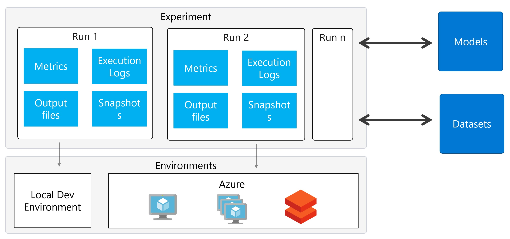

# exp-repro
This repo is built by Hossein Sarshar for the [AISC MLOps Workshop](https://www.eventbrite.ca/e/premium-hands-on-workshop-ml-ops-cloud-for-successful-ml-products-tickets-71406154731?aff=lunch#). Should you have any questions, feel free to email me at hossein.sarshar@gmail.com or tweet me at [classicboyir](https://twitter.com/classicboyir).

The aim is to provide a step to step guide to build reproducible experiments.

For full MLOps guide, please check my other repo focusing on building [CI/CD pipeline for you ML workload](https://github.com/classicboyir/build-release-ci-cd).
